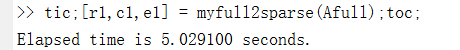
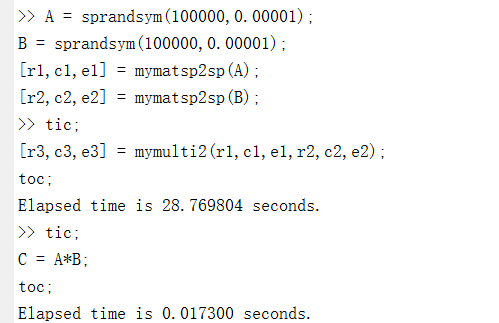

# SparseMatrix
Implement the storage and operation of sparse matrix in matlab.

## 按行三数组与全存储相互转换

### 全存储转换为三数组

		通过两个for循环将全矩阵转换为按行三数组存储模式，时间复杂度为$O(n^2)$，运行结果见下图,转换结果的正确性可以通过后续运算过程体现出来
		

### 三数组转换为全存储
		通过两个for循环，其中一个for循环对行遍历，然后第二个for循环对该行非零元素(含对角元)进行遍历。假设每行非零元分布大体均匀，于是时间复杂度为$O(n\times \frac{N}{n}) = O(N)$,考虑极端情况，时间复杂度为$O(n\times N)$。

		运行结果如下图所示，转换结果的正确性可以通过后续运算过程体现出来。
		

## 按行三数组与Matlab稀疏存储

### Matlab稀疏存储转换为按行三数组存储

		首先通过对非零行元素从小到大排序，然后对非零元按行进行遍历进而online转换为三数组存储,对某行全空对对角元进行操作，因为是online的，所以可以判断时间复杂度为$O(n)$

		运行结果如下图所示，转换结果的正确性可以通过后续运算过程体现出来。
		

### 按行三数组存储转换为Matlab稀疏存储

		通过两个for循环，其中一个for循环对行遍历，另一个对每行的非零元(含对角元)历。设每行非零元分布大体均匀，于是时间复杂度为$O(n\times \frac{N}{n}) = O(N)$,考虑极端情况，时间复杂度为$O(n\times N)$。

		运行结果如下图所示，转换结果的正确性可以通过后续运算过程体现出来。
		

## 在指定位置添加非零元素
		避免了使用for循环，采用矩阵运算(代码24,25行),故时间复杂度可以看作是$O(1)$。值得说明的是，这个函数还可以向已有非零元进行加法计算，这是为了方便后续矩阵加矩阵做铺垫。

		运行结果如下图所示,通过判断$C$与$A$是否相等来检验正确性
		

## 剔零压缩存储

		避免了for循环，采用矩阵向量运算，于是可以将时间复杂度看成是$O(1)$。
		运行结果如下图所示,通过时间来看，这与上述时间复杂度的判断是一致的，而且结果是正确的。
		

## 矩阵加法

		对第二个矩阵的非零元进行遍历，利用myadd.m先把第二个矩阵的每一个非零元插入第一个矩阵中，这里有两种情况，一是添加的元素在矩阵一中不为零（或是对角元），这种就相当于简单的在矩阵一中添加非零元；第二种情况是矩阵二中的元素在矩阵一中对应的元素非零(或为对角元)，亦即在entries1中有相应的元素，这是利用在myadd.m中后一段代码便可以实现加法，同时还可以实现压缩存储。

		又因为myadd.m的时间复杂度为$O(1)$，myzero.m的时间复杂度为$O(1)$,则此时时间复杂度为$O(N_2)$，其中，$N_2$为第二个矩阵的非零元个数。

		运行结果如下图所示，通过判断$C1$与$C$是否相等，来判断运算结果的正确性。
		

## 矩阵减法

		矩阵减法直接利用上述矩阵加法，故其时间复杂度也为$O(N_2)$。
		运行结果如下图所示
		

## 矩阵乘向量

		通过两个for循环，其中一个for循环对行遍历，另一个对每行的非零元(含对角元)遍历。设每行非零元分布大体均匀，于是时间复杂度为$O(n\times \frac{N}{n}) = O(N)$,考虑极端情况，时间复杂度为$O(n\times N)$

		对于$A\times b$，$A$为$10^4$阶方阵，$b$为$1\times 10^4$的行向量，结果如下图所示，可见虽然运算速度远不及matlab，但仍属于可接受的范围，而且运算结果是正确的。

		

## 矩阵乘矩阵

		考虑矩阵$A\times B$,对矩阵$A$的行进行遍历，对矩阵的每一行中的非零元(含对角元)，对于在矩阵$B$中的对应的行，找出非零元所在的列组成nonzerocol2,这样矩阵乘法只需要对矩阵$A$的每一行和nonzerocol2中的列进行运算，在非零元分布相对均匀时情况下，时间复杂度为$O(n\times \frac{N_1}{n} \times  \frac{N_2}{n}) = O(\frac{N_1N_2}{n})$,极端情况下，时间复杂度为$O(n\times N_1 \times N_2)$

		对于一万乘以一万，稀疏度为$10^{-4}$的矩阵，运行结果如下图所示。可见虽然效率跟matlab相比完全不在一个量级，但至少说得过去，毕竟matlab有一堆数学家在研究算法。
		

		下图展现了运算结果的正确性，因为没有元素是不相等的。
		

		挑战十万乘十万阶的矩阵
		发现还是可以运行的,虽然跟matlab的运行速度相差更大。

		
